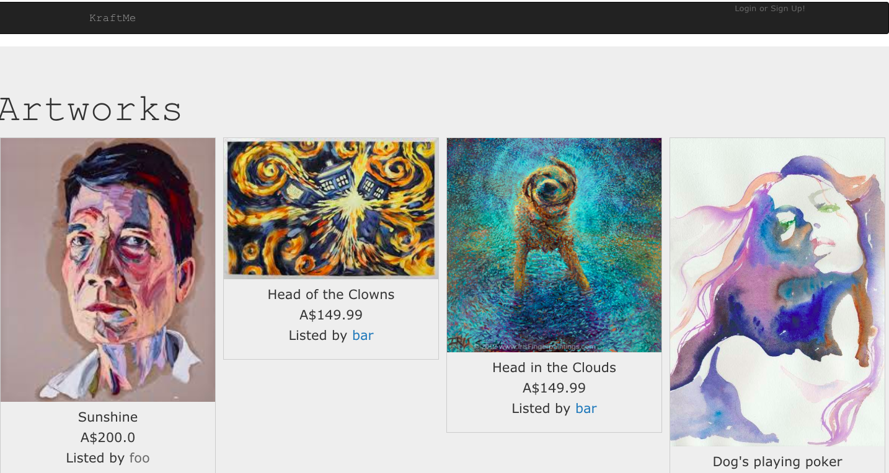
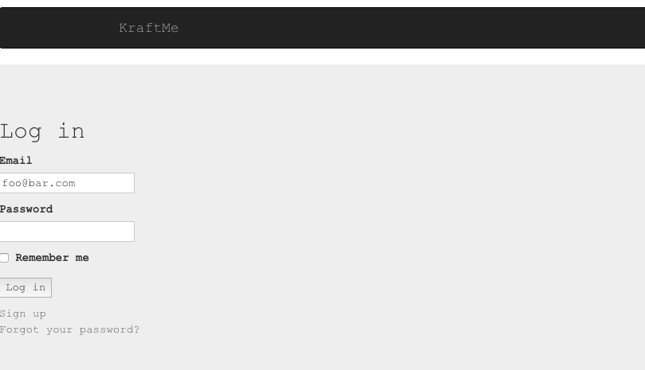
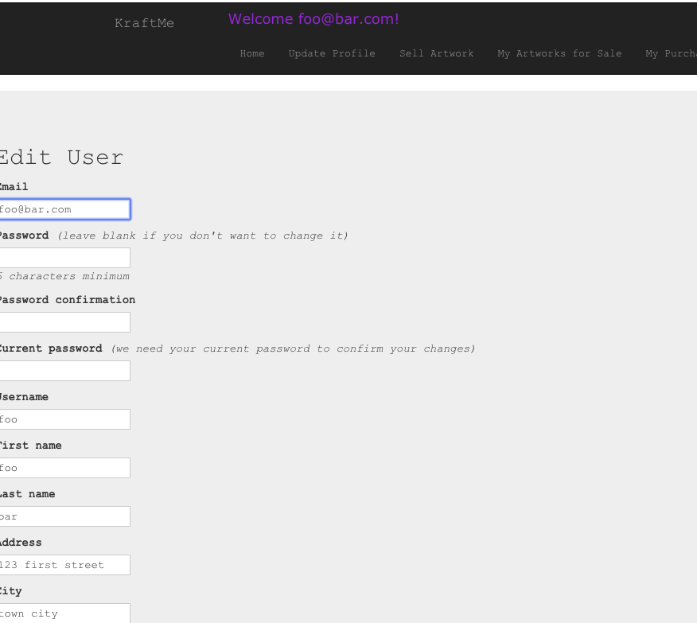
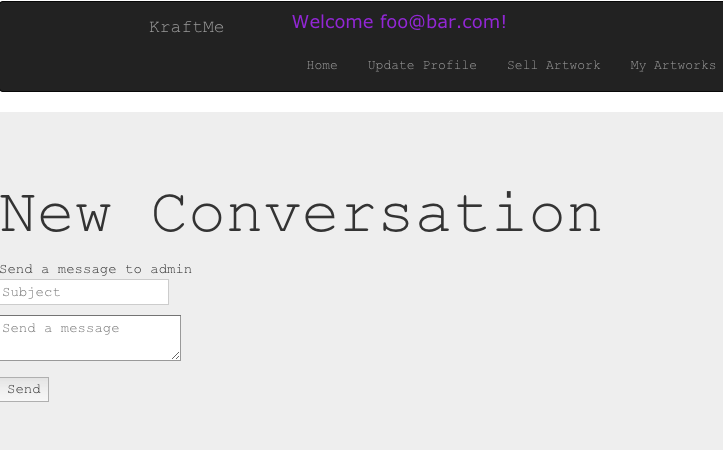
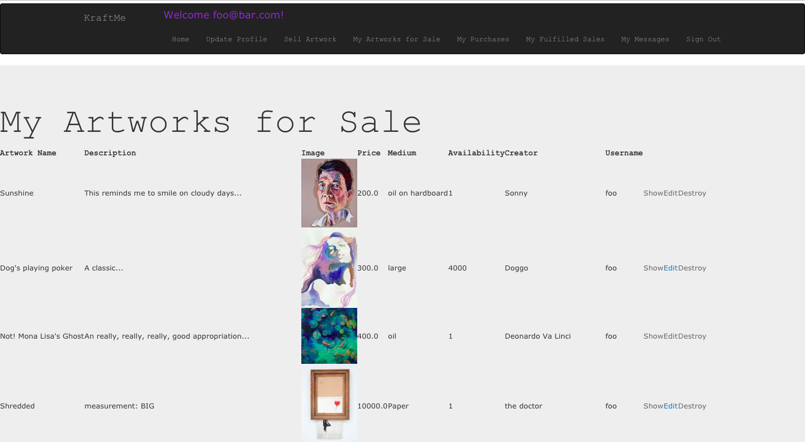
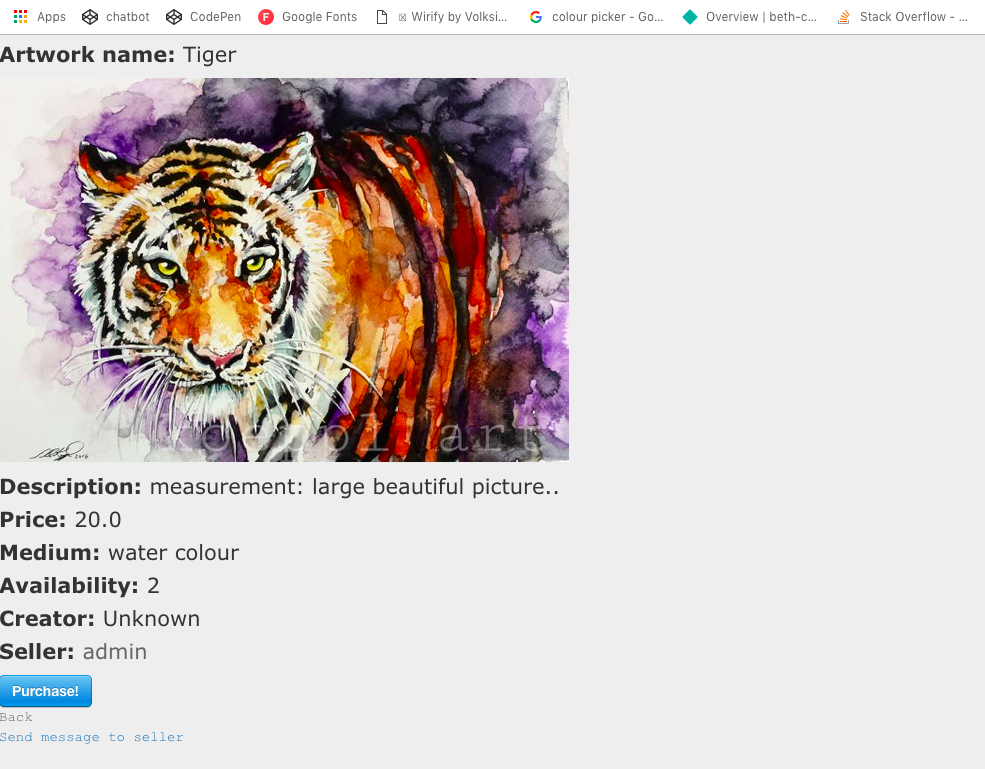
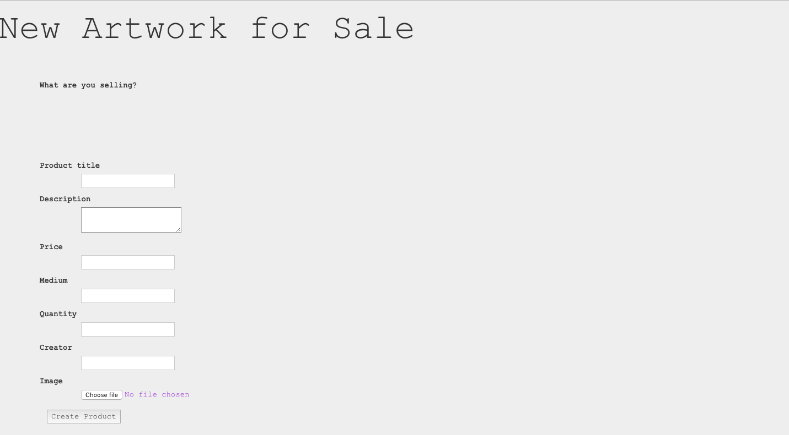
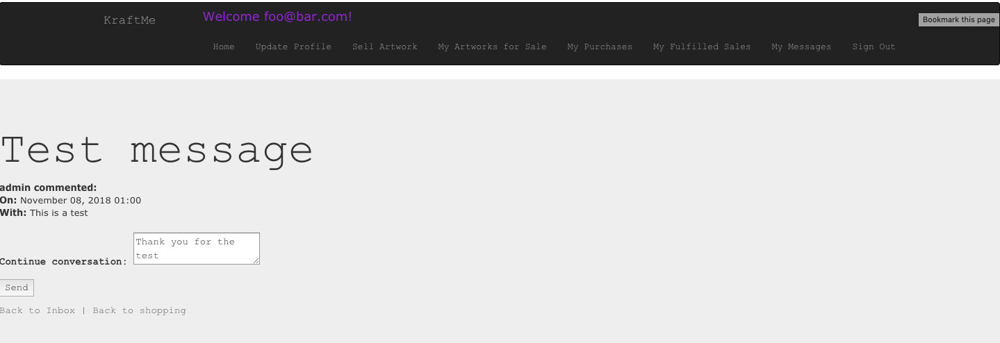
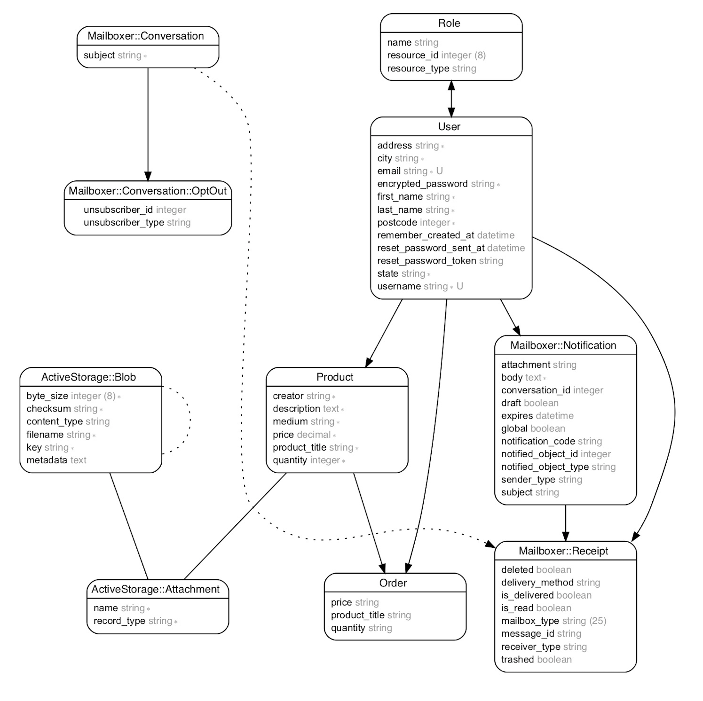
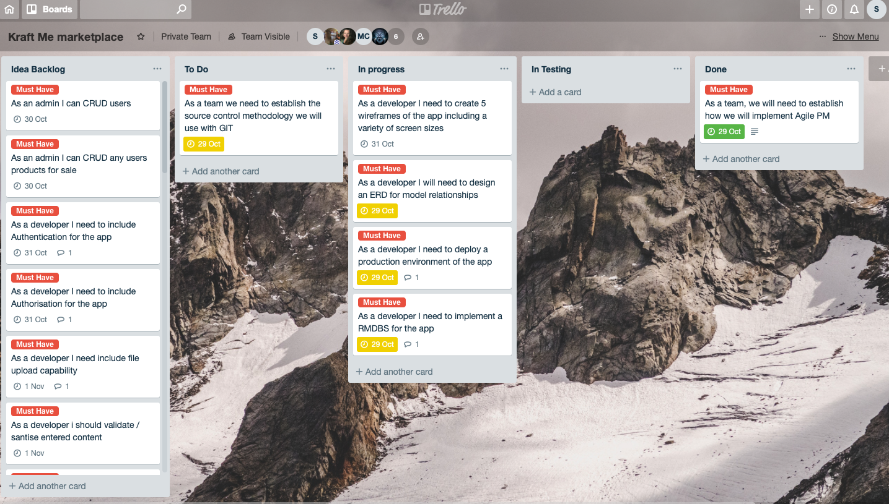

# KraftMe Marketplace App

## Link to published site URL
[Visit the KraftMe application](https://young-scrubland-51531.herokuapp.com)

## Link to GitHub (public)
[Central GitHub Repository](https://github.com/EnFen/kraftme)
## Description of project,including,

### Problem definition / purpose
The purpose of KraftMe is to create a local artist market place - initially focussing on locations within  Australia -  where artists can display, buy and sell their works. 
Consumers will also be able to use the application to view work by local artists,  contact them and/or buy artworks they love,  all on the same platform. 

### Functionality / features
The application allows for the following:
  * User can make accounts and buy and sell artwork
  * User can upload images for artworks that they list on the site
  * User can see their purchase and sales history
  * User can send messages to the sellers of the artworks
  * Admin has a view that allows them to edit and destroy all artworks listed on site
  * Admin has view that allows them to see all transactions on site

## Screenshots


















### Tech stack (e.g. html, css, deployment platform, etc)
The following technologies were used in the development and deployment of the KraftMe Marketplace App:
  * Ruby on Rails
  * HTML
  * CSS
  * Git/Github
  * Heroku

### Instructions on how to setup, configure and use your App.
A standard user of the site must first proceed to the [KraftMe Marketplace](https://young-scrubland-51531.herokuapp.com), where they will be able to view all available artworks in the KraftMe gallery. Once they have created a user profile and signed up, they will be able to access and participate in the rest of the website, including posting their own artworks for sale, contacting artists, or making a purchase.
At this time, admin level users must request access from the developers, who will set up the account and then provide the user with an appropriate admin level username and password.

## Design documentation


### Design process 
Our group started by brainstorming ideas for the marketplace, and decided to create an Australian only market place, where users can buy and sell their artworks. The application will be a place where people can find local artists, get in contact with them, buy artwork and also have the option to get their own masterpieces out to the public.  
Then we proceeded with doing the ERD, the user stories, and then started the development. We decided on the MVP features so we can prioritise them first and then identify nice-to-have features that we can work on given the timeline given for the assignment. Development was done via pair and solo programming.

### User stories
User stories were written on to cards on our Trello Board. Progress of our project over time, including how user stories were added, modified, and addressed in the project can be seen [here](./docs/trello_boards)

### A workflow diagram of the user journey/s.


### Wireframes
An example of one of our low-fi wireframes for the KraftMe Marketplace app is shown below:

.jpg)

For a gallery of all of the wireframes we designed for the app, visit [here](./docs/wireframes)

### Database Entity Relationship Diagrams


### Validation
See the processes we used to describe our validation rules for users and products [here](./docs/validation_rules)

## Details of planning process

### Project plan & timeline
A project plan was developed using the 'Due Date' function on Trello cards as a guide for completing product features.
We had 9 days to complete the project, which progressed according to the following timeline:
  ###### Day One
  * Wireframes
  * ERD Design
  * User Stories
  * Assignment of feature priority for MVP
  * Assignment of due dates for high priority features
  * Git flow set up for all team members
  * Initial deployment of Rails to Heroku
  ###### Day Two - Seven
  * Development of KraftMe app functionality & features
  * Addition of styling (minor)
  * Manual and Automated testing of the application in both development and production environments
  ###### Day Eight - Nine
  * Bugfixes
  * Documentation
  * Presentation preparation
  

### Screenshots of Trello board(s)
Our first Trello board showing the expected plan and timeline for developing the KraftMe Marketplace is shown below: 



Trello progress over our project can be found on the rest of our Trello boards [here](./docs/trello_boards)

# Answers to the Short Answer questions

#### 1. What is the need (i.e. challenge) that you will be addressing in your project?
Australian artists need a way to display and sell their work.
An online artists market offers an opportunity to meet this need using current technology, and encourages consumers to find out about, contact, and support their local artists.

#### 2. Identify the problem you’re trying to solve by building this particular marketplace *App*? Why is it a problem that needs solving?
Currently there are online services on the market which will allow consumers to display, sell, view and purchase artwork, including websites such as Pinterest, Etsy and Amazon. The problem with these services is that ‘local’ artists are often lost, and consequently remain unsupported. 
Consumers in Australia are also faced with the problem of distance; at a practical level this means they have to factor in the shipping and packing of art (and other costs), but at a more personal level it also means that they remain unfamiliar with the artists and creators of the works they purchase.

#### 3. Describe the project will you be conducting and how. your *App* will address the needs.
The purpose of KraftMe is to create a local artist market place - initially focussing on locations within  Australia -  where artists can display, buy and sell their works. 
Consumers will also be able to use the application to view work by local artists,  contact them and/or buy artworks they love,  all on the same platform. 

#### 4. Describe the network infrastructure the *App* may be based on.
Kraftme is a client-server web application running over HTTP.
The first major part of the network infrastructure is a client – which for our app will most often be a user web browser. Upon entering the URL for the Kraftme application, the client will verify the IP address by referencing a Domain Name Server (DNS). HTTP requests and responses are handled through a router which is connected to the internet.
Using the IP obtained from the DNS, the clients request is issued to a Heroku Webserver (all of Heroku’s services are hosted on the AWS EC2 cloud-computing platform). The webserver then constructs the desired response by pulling required content from Heroku application Servers and Heroku Postgres Database, and once completed, the content is served back to the client.
All of the major network infrastructure components described have been illustrated in the following diagram:


*References:*

En.wikipedia.org. (2018). Heroku. [online] Available at: https://en.wikipedia.org/wiki/Heroku  [Accessed 7 Nov. 2018].

Spacey, J. (2018). What is Network Infrastructure?. [online] Simplicable. Available at: https://simplicable.com/new/network-infrastructure  [Accessed 7 Nov. 2018].


#### 5. Identify and describe the software to be used in your *App.*
KraftMe uses the Ruby on Rails (Rails) MVC web framework as its core software.
Rails includes several out-of-the-box software dependencies, or gems, including:
  * Puma – a Ruby webserver
  * Pg – a Ruby interface for PostgreSQL RDBMS utilising SQL
  * Turbolinks – for optimising web application linking speeds
  * JBuilder – provides a domain specific language for building JSON API’s
  * Bootsnap – caching application for reducing boot times
  * Asset pipeline libraries, including SaSS for Rails, which provides our app with the ability to use scss stylesheets, and also Uglifier and CoffeeScript for Rails, which allow for JavaScript compression and transcompilation respectively.
  * Development aids such as ByeBug, Web Console, and Spring which made debugging, and app construction much easier.
In addition to Rails, KraftMe employs the standard front-end web technologies, HTML5, CSS3, and Javascript
 
*References:*

Deveiate.org. (2018). PG: The Ruby PostgreSQL Driver. [online] Available at: https://deveiate.org/code/pg/  [Accessed 7 Nov. 2018].

GitHub. (2018). puma/puma. [online] Available at: https://github.com/puma/puma  [Accessed 7 Nov. 2018].

GitHub. (2018). rails/coffee-rails. [online] Available at: https://github.com/rails/coffee-rails  [Accessed 7 Nov. 2018].

GitHub. (2018). rails/jbuilder. [online] Available at: https://github.com/rails/jbuilder#jbuilder  [Accessed 7 Nov. 2018].

GitHub. (2018). rails/sass-rails. [online] Available at: https://github.com/rails/sass-rails  [Accessed 7 Nov. 2018].

GitHub. (2018). rails/spring. [online] Available at: https://github.com/rails/spring  [Accessed 7 Nov. 2018].

GitHub. (2018). rails/web-console. [online] Available at: https://github.com/rails/web-console  [Accessed 7 Nov. 2018].

GitHub. (2018). turbolinks/turbolinks. [online] Available at: https://github.com/turbolinks/turbolinks  [Accessed 7 Nov. 2018].

Guides.rubyonrails.org. (2018). Ruby on Rails Guides. [online] Available at: https://guides.rubyonrails.org/index.html  [Accessed 7 Nov. 2018].

Rubydoc.info. (2018). File: README — Documentation for bootsnap (1.1.7). [online] Available at: https://www.rubydoc.info/gems/bootsnap/1.1.7  [Accessed 7 Nov. 2018].

Rubydoc.info. (2018). File: README — Documentation for uglifier (4.1.19). [online] Available at: https://www.rubydoc.info/gems/uglifier/  [Accessed 7 Nov. 2018].

Rubydoc.info. (2018). File: README — Documentation for byebug (5.0.0). [online] Available at: https://www.rubydoc.info/gems/byebug/5.0.0  [Accessed 7 Nov. 2018].

#### 6. Identify the database to be used in your *App* and provide a justification for your choice.
We used PostgreSQL Relational Database Management System (RDBMS) for KraftMe, which is a Structured Query Language (SQL) database manager.
The main reason for choosing this database was that we knew we were going to be deploying to Heroku, and Heroku recommends the Heroku Postgres system for websites deployed to their platform. Heroku Postgres is a cloud-based implementation of PostgreSQL, and includes continuous protection (through encryption), high availability, and rollback options as a part of their service.
Other factors which influenced our choice of PostgreSQL include the fact that it is Free and Open Source Software (FOSS), but is very popular, well tested, and strongly supported. It is also highly extensible and designed for scalability, making it suitable for use as our app grows.
In order to identify and/or minimise conflicts which could occur in the production environment, we also used PostgreSQL while developing our app.

*References:*

2ndquadrant.com. (2018). PostgreSQL vs MySQL | 2ndQuadrant. [online] Available at: https://www.2ndquadrant.com/en/postgresql/postgresql-vs-mysql/  [Accessed 7 Nov. 2018].

Devcenter.heroku.com. (2018). Heroku Postgres | Heroku Dev Center. [online] Available at: https://devcenter.heroku.com/articles/heroku-postgresql  [Accessed 7 Nov. 2018].

#### 7. Identify and describe the production database setup (i.e. postgres instance).
To set up our production database on Heroku, we first confirmed that the ‘pg’ ruby gem was installed in our applications ‘Gemfile’, and that all dependencies were resolved using ‘bundle install’.
Next we allocated the appropriate production environment variables in our ‘database.yml’ file. For our app, these were as follows:
```
production:
adapter: postgresql
encoding: unicode
pool: 5
database: kraftme_production
username: kraftme
password: <%= ENV['KRAFTME_DATABASE_PASSWORD'] %>
```
This ‘database.yml’ file, and the variables set within it were recreated on Heroku upon deployment of our application, and the Heroku server parsed the file to create a single DATABASE_URL variable, which contains all the database connection and setup information.  
As our app runs, it is this DATABASE_URL variable which maintains the connection and subsequent transfer of data between our app and the postgres instance on the Heroku Postgres database.

*References:*

Devcenter.heroku.com. (2018). Heroku Postgres | Heroku Dev Center. [online] Available at: https://devcenter.heroku.com/articles/heroku-postgresql#connecting-in-ruby  [Accessed 7 Nov. 2018].

Devcenter.heroku.com. (2018). Heroku Ruby Support | Heroku Dev Center. [online] Available at: https://devcenter.heroku.com/articles/ruby-support#build-behavior  [Accessed 7 Nov. 2018].

Guides.rubyonrails.org. (2018). Configuring Rails Applications — Ruby on Rails Guides. [online] Available at: https://guides.rubyonrails.org/configuring.html#configuring-a-database  [Accessed 7 Nov. 2018].

#### 8. Describe the architecture of your *App*.

#### 9. Explain the different high-level components (abstractions) in your *App*.

#### 10. Detail any third party services that your *App* will use.

#### 11. Describe (in general terms) the data structure of marketplace apps that are similar to your own (e.g. eBay, Airbnb).

#### 12. Discuss the database relations to be implemented.

#### 13. Describe your project’s models in terms of the relationships (active record associations) they have with each other.

#### 14. Provide your database schema design.

#### 15. Provide User stories for your *App*.

#### 16. Provide Wireframes for your *App*.

#### 17. Describe the way tasks are allocated and tracked in your project.

#### 18. Discuss how Agile methodology is being implemented in your project.

#### 19. Provide an overview and description of your Source control process.

#### 20. Provide an overview and description of your Testing process.

#### 21. Discuss and analyse requirements related to information system security.

#### 22. Discuss methods you will use to protect information and data.

#### 23. Research what your legal obligations are in relation to handling user data.


